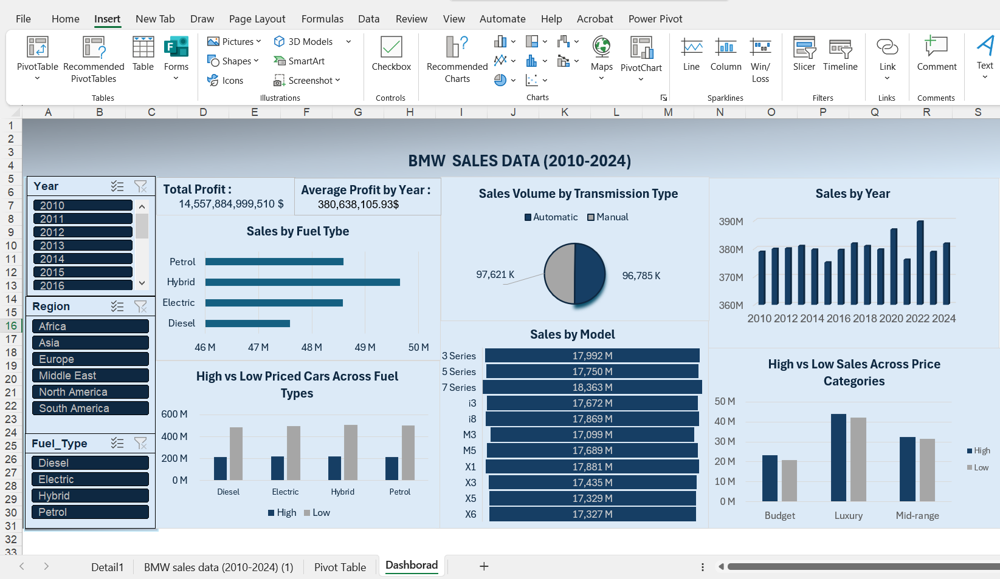

# BMW-Sales-Dashboard-2010-2024-
Excel dashboard analyzing BMW sales 2010–2024
# BMW Sales Dashboard (2010–2024)

This project is an Excel-based dashboard analyzing **BMW sales data from 2010 to 2024**. It includes cleaned data, calculated metrics, pivot tables, and interactive pivot charts.

---

## Project Overview

- **Data Cleaning:** Corrected data types, handled missing or inconsistent entries.  
- **Metrics Added:** Sales_Classification, Revenue, Mileage Band, Price Category.  
- **Analysis Tools:** Pivot Tables and Pivot Charts for interactive data exploration.  

---

## Business Questions Answered

1. **Total Profit & Average Profit by Year:** Understand overall BMW profitability trends.  
2. **Sales by Fuel Type:** Compare Petrol, Diesel, Hybrid, and Electric vehicle sales.  
3. **Sales Volume by Transmission Type:** Distribution of Automatic vs Manual transmissions.  
4. **Sales by Year:** Observe year-over-year sales trends from 2010 to 2024.  
5. **Sales by Model:** Identify top-selling BMW models.  
6. **High vs Low Priced Cars Across Fuel Types & Price Categories:** Examine pricing strategies and market segments.  
7. **Regional Analysis:** Compare BMW sales across Africa, Asia, Europe, Middle East, North America, and South America.  

---

## Files

- `BMW_sales_2010_2024.xlsx` → contains the raw data, cleaned data, pivot tables, and dashboard.  
- `dashboard_screenshot.png` → screenshot of the interactive dashboard.  

---

## Tools Used

- **Excel:** Pivot Tables, Pivot Charts, Conditional Formatting  
- **Business Analysis:** KPI calculation, trends identification, comparative analysis  

---

